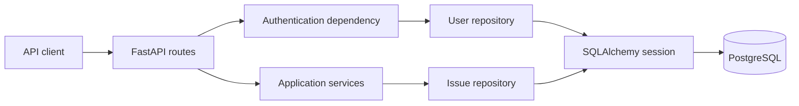
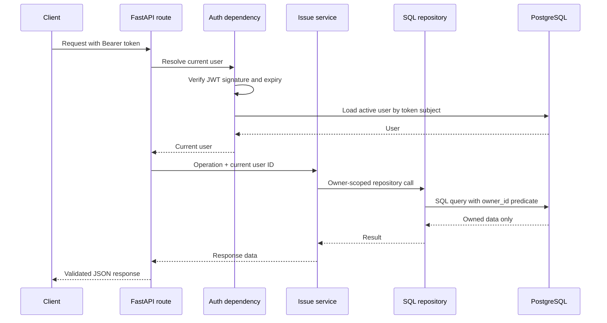
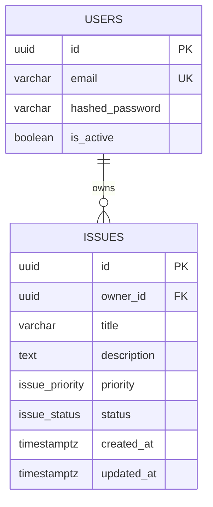

# Architecture

## Overview

The application uses a layered architecture so HTTP behavior, business rules,
and persistence can evolve independently. PostgreSQL is the active persistence
backend. The JSON repository remains as a small reference implementation of the
repository contract.



FastAPI dependencies create one SQLAlchemy session per request. Authentication
and route services share that request lifecycle, and the session is closed when
the request finishes.

## Component responsibilities

| Layer | Location | Responsibility |
| --- | --- | --- |
| Application entry point | `main.py` | Configure FastAPI, middleware, CORS, and routers |
| Routes | `app/routes/` | Parse HTTP input, declare response models, and translate domain errors into HTTP responses |
| Dependencies | `app/dependencies.py` | Resolve bearer tokens and the current active user |
| Services | `app/services/` | Apply authentication and issue business rules |
| Repositories | `app/repositories/` | Query and mutate persistent data |
| Models | `app/models/` | Define SQLAlchemy database mappings and relationships |
| Schemas | `app/schema.py`, `app/auth_schema.py` | Validate API requests and serialize responses |
| Security | `app/security.py` | Hash passwords and encode/decode JWTs |
| Configuration | `app/config.py` | Load environment-backed application settings |
| Migrations | `migrations/` | Version and reproduce the database schema |

Routes do not construct database queries. Services do not depend on FastAPI.
Issue services depend on the `IssueRepository` protocol, allowing another
persistence implementation to be introduced without changing business logic.

## Authenticated request flow



Ownership is enforced in repository queries, not by filtering records after
they are loaded. A user cannot read, update, delete, or enumerate another
user's issues. Both a missing issue and an issue owned by someone else produce
`404 Not Found`.

## Data model



UUIDs are generated by the application. Timestamps are generated in UTC.
Priority and status are PostgreSQL enum types. Indexes support owner filtering,
common issue filters, title access, and creation-time sorting.

`issues.owner_id` is nullable at the database level because ownership was added
after the initial issues migration. Legacy unowned records remain preserved but
are invisible to authenticated users. All issues created by the current API
receive a non-null owner.

## Authentication and authorization

Registration normalizes email addresses to lowercase and stores only an Argon2
password hash. The unique database index prevents duplicate accounts, including
registration races.

Login follows the OAuth2 password form convention:

1. Find the normalized email supplied in the form's `username` field.
2. Verify the password against its Argon2 hash.
3. Sign a JWT containing the user UUID in `sub` and an expiration in `exp`.
4. Resolve the user again for every authenticated request and reject inactive
   or deleted accounts.

JWT configuration is environment-driven. Only the configured algorithm is
accepted during decoding, which prevents clients from selecting an algorithm.

## Query and pagination design

Filtering, searching, sorting, counting, and pagination execute in PostgreSQL.
The repository issues a count query for metadata and a bounded query for the
current page. A UUID tie-breaker is appended to sorting to provide deterministic
ordering when primary sort values are equal.

The API uses offset pagination because it is simple for clients and appropriate
for this sample project's expected data size. Cursor pagination would be a
better choice for very large datasets or feeds receiving frequent inserts.

## Transactions and errors

Repository mutations commit once per create, update, or delete operation. A
registration uniqueness conflict rolls the session back before returning a
domain error. Route handlers translate expected domain failures into stable
HTTP errors:

- `401` for invalid, expired, or inactive-user credentials
- `409` for an already registered email
- `404` for missing or non-owned issues
- `422` for request validation failures

Unexpected database and programming errors are allowed to reach FastAPI's
server-error handling rather than being incorrectly presented as client errors.

## Database lifecycle

Alembic owns schema creation and changes; the application never calls
`metadata.create_all()`. This makes upgrades explicit and reproducible.

The Compose startup order is:

```text
PostgreSQL healthy → Alembic migration succeeds → API starts
```

The migration service is intentionally separate from the API container command.
This avoids every API process attempting schema changes during startup and maps
more cleanly to production deployment jobs.

## Container and CI design

The Dockerfile uses a dependency builder followed by a slim runtime stage. The
runtime process executes as the unprivileged `app` user and exposes an HTTP
health check. `.dockerignore` prevents local environments, secrets, Git history,
and generated data from entering the build context.

GitHub Actions contains two independent jobs:

- **quality** installs development dependencies, checks dependency consistency,
  runs Ruff and the automated test suite, compiles Python sources, and renders
  all migrations as PostgreSQL SQL without changing a database.
- **container** builds the same Docker image used by Compose.

API integration tests override the request-scoped database dependency with an
isolated in-memory database. Unit tests cover security primitives and the JSON
repository. Coverage is measured across `app/` and must remain at or above 85%.

## Known tradeoffs

- Access tokens cannot currently be refreshed or revoked.
- Offset pagination becomes slower at very large offsets.
- Search uses case-insensitive SQL matching rather than PostgreSQL full-text
  search.
- The health endpoint reports process health, not database readiness.
- CORS is permissive for development and must be restricted for production.
- JSON persistence is retained for learning purposes but is not used by the
  running API.
